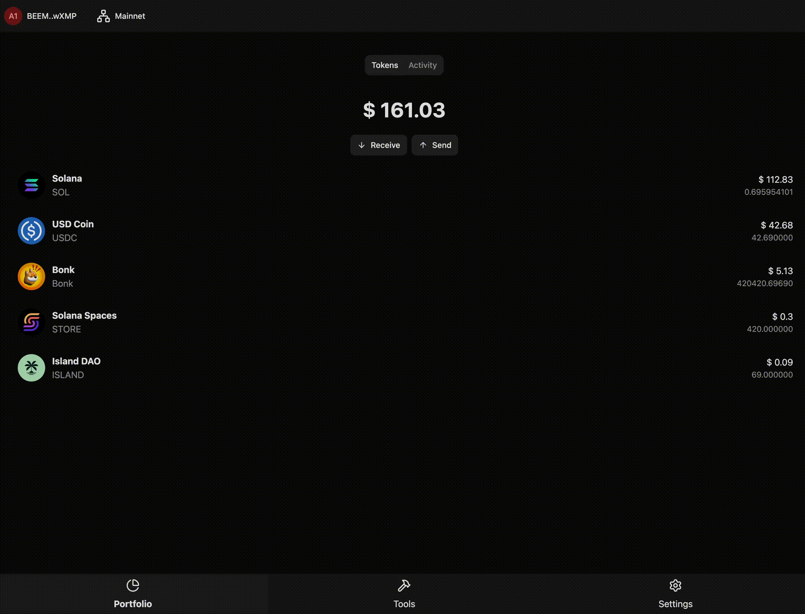

<p align="center">
  <a href="https://samui.build">
    <picture>
      <source srcset="logo-dark.svg" media="(prefers-color-scheme: dark)">
      <source srcset="logo-light.svg" media="(prefers-color-scheme: light)">
      
    </picture>
  </a>
</p>

<p align="center">Open Source Solana wallet and toolbox for builders 🏟 Cypherpunk Hackathon</p>

<p align="center">
    <a href="https://samui.build/go/discord">
        
    </a>
    <a href="https://github.com/samui-build/samui-wallet/actions/workflows/ci.yaml">
        
    </a>
</p>

[](https://samui.build)

---

## Requirements

- [FNM](https://github.com/Schniz/fnm) or [NVM](https://github.com/nvm-sh/nvm)
- [Node](https://nodejs.org)
- [Bun](https://bun.sh)

## Installation

```bash
git clone git@github.com:samui-build/samui-wallet.git
cd samui-wallet
fnm use # or nvm use
bun install
bun dev # or bun --filter=<app-name> dev
```

## Documentation

For more info on how to configure Samui [head over to our docs](https://samui.build).

## Contributing

If you're interested in contributing to Samui, please read our [contributing docs](./CONTRIBUTING.md) before submitting a pull request.

Samui is currently maintained by [beeman](https://x.com/beeman_nl) and [tobeycodes](https://x.com/tobeycodes), with support from a number of contributors.

<a href="https://github.com/samui-build/samui-wallet/graphs/contributors">
    
</a>

---

**Join our community** [Discord](https://samui.build/go/discord) | [X.com](https://samui.build/go/x)
